<div align="center">

<!-- High-Tech Glowing Dark Theme Header Banner -->
<picture>
  <source media="(prefers-color-scheme: dark)" srcset="./assets/header.svg">
  <source media="(prefers-color-scheme: light)" srcset="./assets/header.svg">
  
</picture>

<br/><br/>

<!-- Animated Typing Subtitle -->


<br/>

<!-- Real-time Stats Badges -->
<p align="center">
  
  
  
</p>

<!-- Social Links -->
<p align="center">
  <a href="https://linkedin.com/in/aviral-trivedi-945871338" target="_blank">
    
  </a>
  <a href="https://instagram.com/_aviraltrivedi0" target="_blank">
    
  </a>
  <a href="https://x.com/AviralTrivedi8" target="_blank">
    
  </a>
  <a href="mailto:trivediaviral46@gmail.com">
    
  </a>
</p>

</div>

---

## 👨‍💻 About Me

```yaml
Name: Aviral Trivedi
Role: Full Stack Developer & AI Enthusiast
Location: India 🇮🇳
Passion: Architecting high-performance web applications and AI-driven solutions
Currently: Developing intelligent tools and sharpening full-stack system designs
Philosophy: "Code with precision, build with passion, learn continuously."
```

- 🚀 **Full-Stack Engineering:** Passionate about building resilient web apps, intuitive UIs, and robust backends.
- 🤖 **AI & Machine Learning:** Creating smart systems, face recognition pipelines, and intelligent dashboards.
- 💡 **Open Source & Collaboration:** Actively exploring, contributing, and exchanging innovative ideas.
- 💬 **Ask Me About:** `C++`, `Python`, `JavaScript`, `Flask`, `Node.js`, `AWS`, and `System Architecture`.
- ⚡ **Fun Fact:** I love transforming complex ideas into clean, elegant, user-friendly software!

---

## 🐍 GitHub Contribution Snake

<div align="center">

  <picture>
    <source media="(prefers-color-scheme: dark)" srcset="https://raw.githubusercontent.com/Aviraltrivedi7/Aviraltrivedi7/output/github-contribution-grid-snake.svg">
    <source media="(prefers-color-scheme: light)" srcset="https://raw.githubusercontent.com/Aviraltrivedi7/Aviraltrivedi7/output/github-contribution-grid-snake.svg">
    
  </picture>

</div>

---

## 💻 Tech Stack & Tooling

### 🚀 Programming Languages
<p align="left">
  
  
  
  
  
  
</p>

### ⚙️ Frameworks & Libraries
<p align="left">
  
  
  
  
  
</p>

### ☁️ Cloud & Databases
<p align="left">
  
  
  
  
  
</p>

### 🛠️ Big Data, DevOps & Tools
<p align="left">
  
  
  
  
  
  
</p>

---

## 📊 GitHub Analytics & Activity

<p align="center">
  
  
</p>

<p align="center">
  
</p>

---

## 🌟 Featured Projects

<p align="center">
  <a href="https://github.com/Aviraltrivedi7/Face-Recognition-Attendance-System" target="_blank">
    
  </a>
  <a href="https://github.com/Aviraltrivedi7/aarogya-assistant" target="_blank">
    
  </a>
</p>

<p align="center">
  <a href="https://github.com/Aviraltrivedi7/AgroAI-Dashboard-UI-Design" target="_blank">
    
  </a>
  <a href="https://github.com/Aviraltrivedi7/kanpur-metro-safar-guide" target="_blank">
    
  </a>
</p>

---

## 💡 Developer Thought

<div align="center">
  
</div>

<br/>

<!-- High-Tech Dark Theme Footer Banner -->
<div align="center">
  <picture>
    <source media="(prefers-color-scheme: dark)" srcset="./assets/footer.svg">
    <source media="(prefers-color-scheme: light)" srcset="./assets/footer.svg">
    
  </picture>
  <br/><br/>
  <p>⭐ <strong>Crafted with passion by <a href="https://github.com/Aviraltrivedi7">Aviral Trivedi</a></strong> ⭐</p>
</div>
